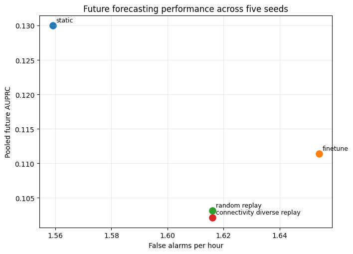
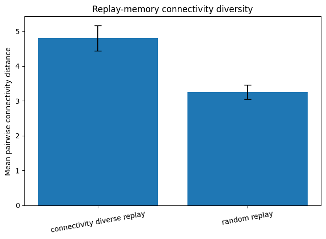
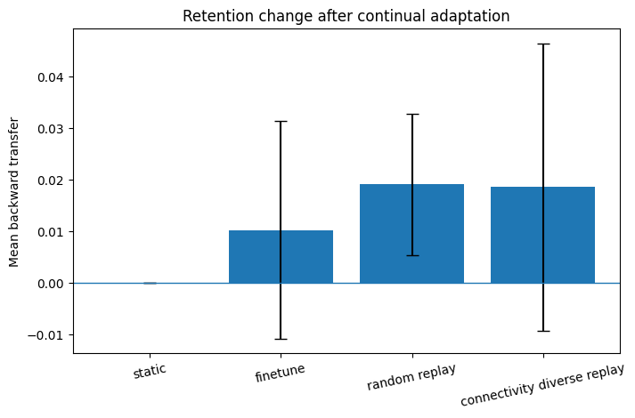

<div align="center">

#  Temporal EEG State Knowledge Graphs for Patient-Specific Seizure Forecasting

### A chronological continual-learning study using EEG functional connectivity, graph neural networks, replay learning, and temporal knowledge graphs

<br>

[](https://www.python.org/)
[](https://pytorch.org/)
[](https://scikit-learn.org/)
[](https://jupyter.org/)

[](https://physionet.org/content/chbmit/1.0.0/)
[](https://physionet.org/)
[](#)
[](#)

<br>

**Muhammad Idrees and Adnan Amin**

Institute of Management Sciences, Peshawar, Pakistan

</div>

---

## Project Overview

This repository contains the code, experiment pipeline, summary results, and reproducibility information for the study:

> **Temporal EEG State Knowledge Graphs for Patient-Specific Seizure Forecasting: A Chronological Continual-Learning Study**

The main research question is:

> **Can the way a patient's EEG connectivity states change over time provide useful information for forecasting future seizures?**

Instead of only asking whether a neural network can classify EEG windows, this study investigates whether a structured temporal history of EEG connectivity can provide additional information.

The work combines:

- EEG signal processing
- Functional connectivity graphs
- Graph neural networks
- Continual learning
- Replay memory
- Knowledge graphs
- Strict chronological evaluation
- Event-level seizure forecasting metrics

---

#  Why This Problem Matters

Seizure forecasting is different from seizure detection.

A detection system may identify a seizure once ictal activity has already started.

A forecasting system must instead estimate elevated seizure risk **before seizure onset**.

This creates a harder problem:

```text
Past EEG
   ↓
Learn patient-specific patterns
   ↓
Receive genuinely future EEG
   ↓
Forecast seizure risk
   ↓
Only afterward reveal what actually happened
```

EEG is also non-stationary.

The same patient's neural activity can change across:

- recording sessions,
- days,
- seizure episodes,
- behavioral states,
- and electrode conditions.

A model trained on early recordings may therefore encounter a different EEG distribution later.

This study was designed around that challenge.

---

# 💡 Main Idea

Traditional forecasting models mainly use the current EEG representation.

This study asks whether **historical transitions between recurring EEG connectivity states** can add useful information.

For example:

```text
State 3
   ↓
State 7
   ↓
State 4
   ↓
Preictal EEG
```

may contain more useful temporal information than simply knowing:

```text
Current state = State 4
```

We therefore created a **patient-specific temporal EEG state knowledge graph**.

---

#  Full Experimental Pipeline

```text
                    CHB-MIT EEG
                         │
                         ▼
               Protocol / data audit
                         │
                         ▼
                 EEG preprocessing
                         │
                         ▼
              10-second EEG windows
                  5-second stride
                         │
              ┌──────────┴──────────┐
              │                     │
              ▼                     ▼
       Spectral node features   Functional connectivity
       5 frequency bands       Signed Pearson correlation
              │                     │
              └──────────┬──────────┘
                         │
                         ▼
                  22-node EEG graph
                         │
                         ▼
              Patient-specific GNN
                         │
             ┌───────────┴───────────┐
             │                       │
             ▼                       ▼
     Continual-learning        EEG connectivity
         baselines              state discovery
                                     │
                                     ▼
                              Temporal knowledge
                                   graph
                                     │
                           ┌─────────┴─────────┐
                           │                   │
                           ▼                   ▼
                    KG-guided replay    Direct KG guidance
                           │                   │
                           └─────────┬─────────┘
                                     │
                                     ▼
                         Chronological evaluation
```

---

#  Dataset

## CHB-MIT Scalp EEG Database

The experiments use the publicly available:

### 🔗 [CHB-MIT Scalp EEG Database on PhysioNet](https://physionet.org/content/chbmit/1.0.0/)

### 🔗 [Official dataset DOI: 10.13026/C2K01R](https://doi.org/10.13026/C2K01R)

The CHB-MIT database contains long-term scalp EEG recordings from pediatric patients with intractable seizures.

The database includes:

- EDF EEG recordings
- seizure annotations
- patient recording summaries
- multiple recording sessions
- seizure and non-seizure EEG
- multichannel scalp EEG

EEG recordings were sampled at:

```text
256 Hz
```

>  The original CHB-MIT EDF recordings are **not included in this repository**.  
> They should be downloaded directly from PhysioNet.

---

#  EEG Preprocessing

Every EDF recording was processed independently.

This is important because filtering across separate EEG files could introduce artificial information across recording gaps.

### Main preprocessing settings

| Parameter | Value |
|---|---:|
| Sampling frequency | 256 Hz |
| Band-pass filter | 0.5–45 Hz |
| Filter | 4th-order Butterworth |
| Filtering mode | Zero-phase |
| EEG window | 10 seconds |
| Window stride | 5 seconds |
| Fixed montage | 22 bipolar channels |

Windows containing:

- non-finite values, or
- zero-variance channels

were rejected.

No future samples were used to repair rejected windows.

---

#  EEG Node Features

Each EEG graph contains:

```text
22 nodes = 22 bipolar EEG channels
```

For every channel, five frequency-band powers were calculated.

| Frequency band | Range |
|---|---:|
| Delta | 0.5–4 Hz |
| Theta | 4–8 Hz |
| Alpha | 8–13 Hz |
| Beta | 13–30 Hz |
| Gamma | 30–45 Hz |

Power spectral density was estimated using Welch's method.

Settings included:

- 2-second Hann segments
- 50% overlap
- constant detrending
- density scaling

Band power was then transformed using:

```text
log10(power)
```

Therefore each EEG node contains:

```text
5 spectral features
```

---

#  Functional Connectivity Graph

The relationships between EEG channels were represented using **signed Pearson correlation**.

For 22 channels:

```text
22 × 21 / 2 = 231
```

unique pairwise connectivity values are obtained.

Unlike approaches that use only absolute connectivity strength, this study preserves:

```text
positive correlations
+
negative correlations
```

This allows the graph to retain the direction of channel co-variation.

---

#  Graph Neural Network

Each 10-second EEG window becomes a graph.

### GNN configuration

| Component | Setting |
|---|---:|
| Nodes | 22 |
| Node features | 5 |
| Connectivity features | 231 |
| Graph layers | 2 |
| Hidden dimension | 32 |
| Activation | GELU |
| Normalization | LayerNorm |
| Dropout | 0.2 |
| Pooling | Mean pooling |
| Trainable parameters | 3,649 |

The adjacency matrix remains signed.

Graph normalization uses the absolute weighted degree while retaining the signed adjacency values.

Patient-specific feature normalization is fitted **only on the initial training data** and then frozen.

---

#  Strict Chronological Evaluation

One of the most important parts of this project is the evaluation protocol.

Future seizures are never mixed into training before they are evaluated.

The future stream follows:

```text
PREDICT
   ↓
EVALUATE
   ↓
REVEAL LABEL
   ↓
UPDATE
```

This means:

> A seizure can never contribute information to its own prediction.

This is closer to how a real forecasting system would operate.

---

# Seizure Forecasting Definition

The study used:

```text
Seizure Prediction Horizon (SPH) = 5 minutes
Seizure Occurrence Period (SOP)  = 30 minutes
```

For seizure onset at time `ts`:

```text
Preictal interval =
[ts - 35 minutes, ts - 5 minutes)
```

Clean interictal EEG was required to remain at least:

```text
4 hours
```

away from every annotated seizure.

---

#  Final Eligible Cohort

The complete CHB-MIT cohort was screened under predefined chronological and montage rules.

Three patients satisfied all requirements.

| Patient | Train preictal | Train interictal | Future seizures | Clean future EEG |
|---|---:|---:|---:|---:|
| chb06 | 1,555 | 9,676 | 4 | 11.011 h |
| chb09 | 480 | 12,447 | 2 | 30.954 h |
| chb10 | 479 | 17,143 | 4 | 0.113 h |
| **Total** | **2,514** | **39,266** | **10** | **42.078 h** |

The study therefore evaluates:

```text
3 patients
10 future seizures
42.078 hours of clean future EEG
```

Because only three patients qualified, results are interpreted descriptively rather than as population-level clinical evidence.

---

#  Continual Learning

Four main continual-learning strategies were tested.

### 1. Static

The initially trained model is never updated.

### 2. Fine-tuning

The model adapts using only newly revealed EEG.

### 3. Random replay

The model adapts using:

```text
current EEG
+
random historical examples
```

### 4. Connectivity-diverse replay

Historical examples are selected to cover a wider region of the EEG connectivity space.

A fixed replay budget of:

```text
128 windows
```

was used.

---

#  Continual-Learning Results

| Method | Future AUPRC | Sensitivity | False alarms/h | Backward transfer |
|---|---:|---:|---:|---:|
| **Static GNN** | **0.1300 ± 0.0580** | 1.000 | 1.5590 ± 0.0360 | 0.0000 |
| Fine-tuning | 0.1114 ± 0.0650 | 1.000 | 1.6541 ± 0.0725 | 0.0103 ± 0.0211 |
| Random replay | 0.1031 ± 0.0523 | 1.000 | 1.6161 ± 0.0000 | 0.0191 ± 0.0137 |
| Connectivity-diverse replay | 0.1021 ± 0.0466 | 1.000 | 1.6161 ± 0.0000 | 0.0186 ± 0.0278 |
| State-KG replay | 0.0928 ± 0.0462 | 1.000 | 1.6161 ± 0.0000 | -0.0044 ± 0.0163 |
| Temporal-KG replay | 0.0952 ± 0.0482 | 1.000 | 1.6161 ± 0.0000 | -0.0040 ± 0.0146 |

---

#  Future Forecasting Performance

<p align="center">
  
</p>

The static GNN achieved the highest pooled future AUPRC.

This is an important result:

> **Adapting a model does not automatically make it better at forecasting genuinely future EEG.**

Fine-tuning and replay preserved or changed previously learned information, but they did not improve pooled future forecasting in this experiment.

---

#  Replay Memory Diversity

Connectivity-diverse replay successfully produced a more diverse replay memory.

### Mean pairwise connectivity distance

```text
Random replay                 = 3.248
Connectivity-diverse replay   = 4.794
```

This represents approximately:

```text
+47.6%
```

greater connectivity diversity.

<p align="center">
  
</p>

However:

> Higher replay diversity did not improve pooled future AUPRC.

This demonstrates that a memory can be structurally diverse without necessarily containing the most useful samples for future forecasting.

---

#  Retention and Backward Transfer

Backward transfer measures whether performance on previously retained examples improves or declines after continual adaptation.

<p align="center">
  
</p>

Random and connectivity-diverse replay produced positive mean backward transfer.

However:

> Better retention of historical knowledge did not translate into better forecasting of future seizures.

This distinction is important in continual-learning systems.

---

#  Temporal EEG State Knowledge Graph

Historical EEG connectivity patterns were clustered into:

```text
12 recurring connectivity states per patient
```

using MiniBatch k-means.

These states are **data-driven connectivity states**.

They should not be interpreted as medically established neurological states.

---

## Knowledge Graph Entities

Each patient's graph contains:

```text
Patient
Connectivity states
Preictal condition
Interictal condition
```

---

## Knowledge Graph Relations

Three typed relations are represented:

```text
patient
   │
   └── exhibits ──> connectivity state


connectivity state
   │
   └── associated_with ──> preictal / interictal


connectivity state
   │
   └── transitions_to ──> connectivity state
```

Temporal transitions are counted only when two EEG windows:

- belong to the same EDF file, and
- occur at the expected 5-second interval.

This avoids creating false transitions across recording gaps.

---

#  Why Add Temporal Relationships?

Suppose a patient repeatedly follows:

```text
State 2 → State 8 → State 5 → Preictal
```

Knowing only that the patient is currently in:

```text
State 5
```

loses information about how the EEG arrived there.

The temporal knowledge graph therefore models:

```text
Current state
+
Historical state transitions
+
Historical preictal association
```

---

#  Knowledge-Graph-Guided Replay

Two KG-based replay strategies were tested.

## State-KG Replay

Replay examples are prioritized using the historical class association of their current connectivity state.

## Temporal-KG Replay

Replay selection additionally considers states that historically followed the current state.

Results:

```text
State-KG replay AUPRC      = 0.0928
Temporal-KG replay AUPRC   = 0.0952
Difference                 = +0.0024
```

The improvement was small.

Neither KG replay method exceeded random replay or the static GNN.

---

#  Direct Knowledge-Graph Guidance

A second experiment tested the knowledge graph in a different role.

Instead of selecting replay examples, the knowledge features were combined **directly with the GNN prediction**.

Three models were compared.

### GNN only

```text
GNN logit
```

### State-guided

```text
GNN logit
+
current-state preictal association
```

### Temporal-guided

```text
GNN logit
+
current-state preictal association
+
expected next-state preictal association
```

Small logistic-regression fusion heads were used so that the contribution of the KG features remained interpretable.

---

#  Direct KG Results

| Method | Future AUPRC | Brier score | Sensitivity | False alarms/h |
|---|---:|---:|---:|---:|
| **GNN only** | **0.1300 ± 0.0580** | **0.3136 ± 0.0301** | 1.000 | 1.5448 ± 0.0557 |
| KG state-guided | 0.1002 ± 0.0121 | 0.5498 ± 0.0533 | 1.000 | 1.5353 ± 0.0521 |
| KG temporal-guided | **0.1178 ± 0.0348** | 0.5825 ± 0.0390 | 1.000 | 1.5685 ± 0.0291 |

The temporal model improved over the state-only model by:

```text
Mean AUPRC difference = +0.017651
```

The temporal-minus-state difference was positive in:

```text
5 / 5 optimization runs
```

However:

> The temporal KG model still did not exceed the standalone GNN overall.

---

#  Patient-Specific Results

The effect of temporal knowledge differed between patients.

| Patient | GNN only | State KG | Temporal KG |
|---|---:|---:|---:|
| chb06 | 0.1341 | 0.1378 | **0.1770** |
| chb09 | **0.0301** | 0.0290 | 0.0294 |
| chb10 | 0.9505 | 0.9598 | **0.9613** |

This variation is important.

Temporal state information was useful for some patients but not equally useful for all patients.

Patient-level AUPRC values should not be compared directly because the future class balance and clean EEG exposure differed substantially between patients.

---

#  Main Findings

<div align="center">

### 🔵 Finding 1

**Temporal state relations contained information beyond state identity alone.**

### 🟢 Finding 2

**Temporal guidance achieved higher AUPRC than state-only guidance in all five direct-guidance runs.**

### 🟣 Finding 3

**Temporal information was more useful for direct prediction than for replay selection.**

### 🟠 Finding 4

**The standalone GNN still achieved the highest pooled future AUPRC.**

### 🔴 Finding 5

**The false-alarm burden remained too high for clinical use.**

</div>

---

#  Sensitivity vs False Alarms

All evaluated methods detected all:

```text
10 future seizures
```

giving:

```text
Sensitivity = 1.0
```

However, false-alarm rates remained approximately:

```text
1.5+ false alarms per clean EEG hour
```

Therefore:

> **The sensitivity result should not be interpreted as evidence of clinical readiness.**

This is a methodological research study, not a validated seizure-warning system.

---

# 🛡️ Leakage and Reproducibility Safeguards

The final experimental design includes several safeguards.

 Patient-specific normalization was fitted only on initial training data.

Future episodes were processed strictly in chronological order.

Every future seizure was evaluated before its labels were revealed.

Retention samples were never used for training or model selection.

KG state centroids were learned from historical training data only.

State centroids were frozen during future evaluation.

 Temporal transitions were restricted to consecutive windows in the same EDF file.

 Fusion heads were fitted before future testing.

 Thresholds were fixed before the future stream.

 Future labels were used only after the corresponding episode had been evaluated.

 Five optimization seeds were treated as training variability, not independent patients.

---

# 🛠️ Engineering & Technical Skills Demonstrated

This repository also demonstrates practical ML and data-engineering skills beyond the research question.

### Data engineering


- multi-file EEG ingestion
- EDF recording audits
- deterministic data splits
- dataset validation
- cache generation
- reproducible manifests
- experiment summaries
- large sequential-data processing

### Machine learning


- graph neural networks
- continual learning
- replay memory
- clustering
- logistic regression
- imbalanced classification
- chronological evaluation
- model-selection controls

### Graph and knowledge representation


- functional-connectivity graphs
- graph normalization
- patient-specific state graphs
- typed knowledge-graph relations
- temporal transition modelling

### Reproducibility


- frozen experiment configurations
- deterministic seeds
- hash-based protocol identification
- clear separation of training and future test data
- reproducible experiment outputs
- documented negative results

---

# 📂 Repository Structure

```text
temporal-eeg-state-kg/
│
├── README.md
├── requirements.txt
├── .gitignore
├── CLEANED_NOTEBOOK_SHA256.txt
│
├── notebooks/
│   ├── 01_protocol_audit.ipynb
│   └── 02_experiment_pipeline.ipynb
│
├── results/
│   ├── cohort_summary.csv
│   ├── continual_and_kg_replay_summary.csv
│   ├── replay_memory_diversity.csv
│   ├── direct_kg_summary.csv
│   ├── direct_kg_patient_summary.csv
│   └── kg_ablation_differences.csv
│
└── figures/
    ├── fig1_future_forecasting.png
    ├── fig2_memory_diversity.png
    └── fig3_retention_change.png
```

---

# 🚀 Reproducing the Study

## 1. Clone the repository

```bash
git clone https://github.com/YOUR_USERNAME/temporal-eeg-state-kg.git
cd temporal-eeg-state-kg
```

Replace `YOUR_USERNAME` with your GitHub username.

---

## 2. Create an environment

```bash
python -m venv .venv
source .venv/bin/activate
```

For Windows:

```bash
.venv\Scripts\activate
```

---

## 3. Install dependencies

```bash
pip install -r requirements.txt
```

---

## 4. Download CHB-MIT

Download the original dataset from:

### 👉 [CHB-MIT Scalp EEG Database — PhysioNet](https://physionet.org/content/chbmit/1.0.0/)

Raw EDF files are intentionally not included in this repository.

---

## 5. Configure paths

The notebooks were developed using Google Colab / Google Drive.

Update the dataset and project paths in the notebook setup cells to match your environment.

---

## 6. Run notebooks in order

```text
01_protocol_audit.ipynb
        │
        ▼
02_experiment_pipeline.ipynb
```

### `01_protocol_audit.ipynb`

Performs:

- CHB-MIT file audit
- seizure-event audit
- montage compatibility analysis
- chronological eligibility checks
- protocol freezing

### `02_experiment_pipeline.ipynb`

Performs:

- EEG preprocessing
- feature extraction
- connectivity generation
- cohort construction
- chronological splitting
- GNN training
- continual-learning experiments
- replay experiments
- knowledge-graph construction
- direct KG guidance
- evaluation
- result generation

---

# 🔐 Frozen Reproducibility Identifiers

```text
Protocol v2 SHA-256
0f82325c0bf85962ee7bdc92a7bc5d25c4fa80d404f625a8b4f199b42c966c90
```

```text
Preprocessing SHA-256
3999e8ee6592657ce0a7c20a682b7c29b95420926bc6fbe0962ba9763f67a107
```

```text
Final split v3 SHA-256
a0db400259564448fd17d5f71547c1431455d4498999faf5bdb96788abab64a2
```

These identifiers help distinguish the final reported experiments from earlier development versions.

---

# ⚠️ Limitations

The study has several important limitations.

- Only three patients satisfied all final chronological eligibility rules.
- The final evaluation contained ten future seizure events.
- Clean future EEG exposure was highly uneven between patients.
- The 12 EEG states are data-driven clusters rather than clinically established neurological states.
- Replay uses a fixed update budget, while candidate selection can access accumulated revealed history.
- Direct KG integration uses a deliberately simple logistic-regression fusion model.
- Only CHB-MIT was evaluated.
- Independent external validation is still required.

---

# 🧭 Future Work

Potential extensions include:

- learning transition importance directly;
- adaptive EEG state representations;
- uncertainty-aware replay selection;
- false-alarm-aware memory selection;
- nonlinear neural-KG fusion;
- larger patient cohorts;
- independent EEG datasets;
- explicit probability-calibration analysis;
- longer-term prospective chronological evaluation.

---

# 📄 Associated Manuscript

**Temporal EEG State Knowledge Graphs for Patient-Specific Seizure Forecasting: A Chronological Continual-Learning Study**

**Authors:**  
Muhammad Idrees  
Adnan Amin

The manuscript is currently associated with this research repository.

Publication information can be added here once available.

---


# 👨‍💻 Authors

### Muhammad Idrees

**Research interests**

- Machine learning
- Data science
- Data engineering
- Graph machine learning
- Biomedical AI
- Continual learning
- Reliable ML systems

Institute of Management Sciences  
Peshawar, Pakistan

---

### Adnan Amin

Institute of Management Sciences  
Peshawar, Pakistan

---

# ⚕️ Research Use Notice

> This repository contains experimental research code.

It is **not a medical device**, has not been clinically validated, and must not be used for:

- clinical diagnosis,
- seizure monitoring,
- medical treatment decisions,
- or patient safety decisions.

---

<div align="center">

## ⭐ If you find this work useful

Consider starring the repository.

<br>


### Built around reproducibility, chronological evaluation, and transparent reporting of both positive and negative results.

</div>
